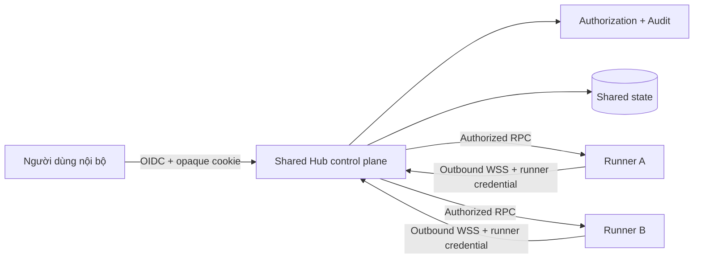
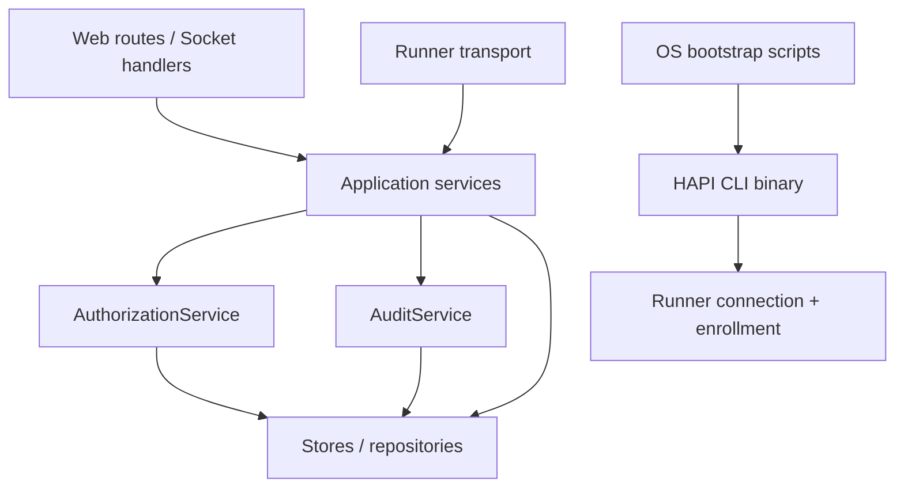
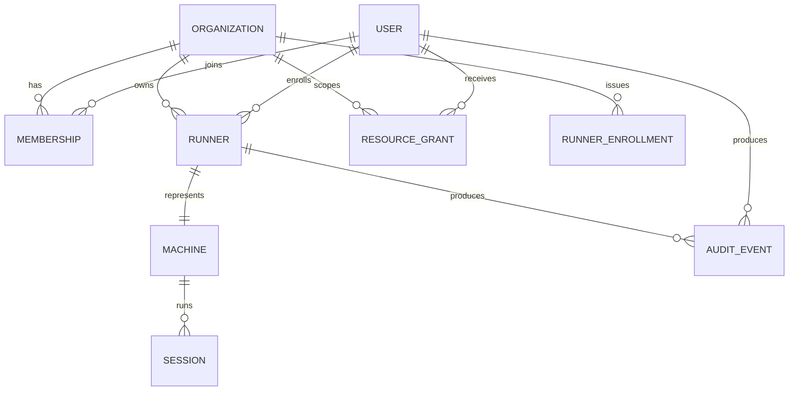
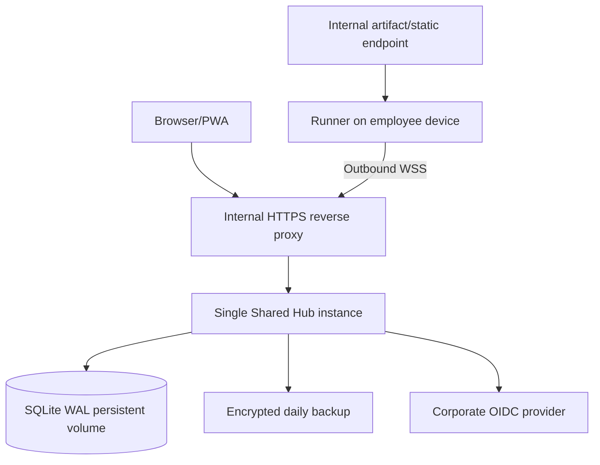

# Architecture Spine — HAPI Shared Hub nội bộ

## Design Paradigm

**Control plane / outbound execution agents.** Shared Hub sở hữu identity, authorization, enrollment, grants, audit và routing. Runner sở hữu execution trên máy local và chỉ chủ động mở kết nối outbound tới Hub.



## Invariants & Rules

### AD-1 — Hub là control plane duy nhất

- **Binds:** toàn bộ Shared Hub.
- **Prevents:** Web, route hoặc Runner tự quyết quyền khác nhau.
- **Rule:** Hub quyết định identity, quyền, routing và audit; Runner không tự cấp quyền truy cập tài nguyên.

### AD-2 — Mọi thao tác có actor và organization context

- **Binds:** REST, SSE, Socket.IO, terminal, RPC, Team Chat.
- **Prevents:** dùng `namespace` như ACL hoặc dùng owner chung cho nhiều người.
- **Rule:** mọi entry point phải tạo `RequestContext { actor, organizationId, roles }`; service không nhận trực tiếp namespace rời rạc để quyết định quyền.

### AD-3 — Authorization tập trung theo action và resource

- **Binds:** session, machine, Runner, terminal, editor, Git, Team Chat.
- **Prevents:** mỗi route tự viết điều kiện quyền khác nhau.
- **Rule:** mọi hành động nhạy cảm gọi cùng `AuthorizationService.can(context, action, resource)` trước khi đọc, mutate hoặc route RPC.

### AD-4 — Mỗi Runner có credential riêng

- **Binds:** `/cli` Socket.IO, Runner heartbeat, machine RPC.
- **Prevents:** lộ shared `CLI_API_TOKEN` cho phép chiếm toàn Hub.
- **Rule:** Runner xác thực bằng `runnerId` và secret riêng; Hub chỉ lưu hash; credential có thể rotate và revoke độc lập.

### AD-5 — Enrollment code không phải credential

- **Binds:** Add Runner, bootstrap scripts, enrollment API.
- **Prevents:** lệnh copy-paste trở thành secret dài hạn.
- **Rule:** code dùng một lần, hết hạn tối đa 15 phút, chỉ lưu hash, bị consume atomically và không dùng cho web login hoặc reconnect.

### AD-6 — Bootstrap script mỏng, HAPI binary sở hữu lifecycle

- **Binds:** Windows, Linux, macOS installer.
- **Prevents:** ba script phát triển thành ba implementation khác nhau.
- **Rule:** script chỉ detect platform, tải và verify artifact, rồi gọi `hapi runner enroll --install-service --start`; enrollment, config, service và update nằm trong CLI.

### AD-7 — Artifact phải được xác minh trước khi chạy

- **Binds:** installer, updater, release pipeline.
- **Prevents:** supply-chain compromise qua `curl | sh` hoặc update server.
- **Rule:** mọi binary phải khớp SHA-256 từ manifest; production rollout phải hỗ trợ chữ ký artifact trước khi bật auto-update.

### AD-8 — Ownership mặc định riêng tư

- **Binds:** machine, Runner, session.
- **Prevents:** thành viên mới nhìn thấy hoặc điều khiển toàn bộ máy trong phòng.
- **Rule:** owner và organization Admin có toàn bộ capability; thành viên khác chỉ có quyền từ resource grant rõ ràng. Delegated `manage` không bao gồm transfer/archive/revoke.

### AD-9 — Realtime phải lọc theo cùng authorization

- **Binds:** SSE, Socket.IO rooms, terminal stream.
- **Prevents:** REST chặn đúng nhưng event hoặc terminal rò sang user khác.
- **Rule:** subscription và broadcast được gắn actor context; không broadcast organization-wide nếu tài nguyên không được phép xem.

### AD-10 — Audit là một phần của mutation

- **Binds:** login, enrollment, revoke, grants, session control, permission approval, terminal, editor write, Git write.
- **Prevents:** có thay đổi nguy hiểm nhưng không truy ra ai làm.
- **Rule:** mutation nhạy cảm chỉ trả success sau khi audit event tương ứng được ghi; audit event bất biến ở tầng ứng dụng.

### AD-11 — Pilot chạy single-instance

- **Binds:** deployment cấp phòng.
- **Prevents:** đưa HA/PostgreSQL vào critical path của MVP.
- **Rule:** pilot dùng một Hub process, SQLite WAL, persistent volume và backup; không chạy nhiều Hub replica trên cùng database.

### AD-12 — Update có channel và rollback boundary

- **Binds:** Runner updater.
- **Prevents:** một release lỗi làm toàn bộ Runner mất kết nối cùng lúc.
- **Rule:** Runner thuộc `stable`, `canary` hoặc `pinned`; MVP chỉ auto-update canary trước, stable cần policy được Hub phát hành; luôn giữ binary trước đó để rollback một lần.

## Dependency Direction



Entry points không được gọi SQL trực tiếp. Bootstrap scripts không được tự triển khai business logic enrollment hoặc update policy.

## Consistency Conventions

| Concern | Convention |
| --- | --- |
| Identity | UUID/string opaque ID; external identity nằm ở `externalSubject` |
| Scope | Mọi resource Shared Hub có `organizationId` |
| Secrets | Chỉ trả plaintext một lần; database lưu hash |
| Time | Unix milliseconds trong persistence; ISO-8601 ở API khi cần hiển thị |
| Errors | `{ error: string, code: string }`, không trả stack trace |
| Events | Tên quá khứ: `runner.enrolled`, `runner.revoked`, `grant.created` |
| Mutations | Service transaction: authorize → mutate → audit → publish |
| Config | Shared Hub là mode duy nhất; không fallback sang shared secret hoặc namespace JWT |

## Stack

| Name | Version |
| --- | --- |
| TypeScript | 5.x theo workspace hiện tại |
| Bun | runtime hiện tại của repo |
| Hono | dependency hiện tại của Hub |
| Socket.IO | 4.8.x theo workspace hiện tại |
| Zod | 4.2.x theo workspace hiện tại |
| SQLite | `bun:sqlite`, pilot single-instance |
| JWT/JWS | `jose`, dependency hiện tại |

## Structural Seed

```text
shared/src/
  auth.ts                         # actor, role, action, grant schemas
  runnerEnrollment.ts             # enrollment/version manifest contracts
hub/src/auth/
  requestContext.ts               # transport identity -> RequestContext
  authorizationService.ts         # centralized policy
hub/src/audit/
  auditService.ts                 # append-only security events
hub/src/runnerEnrollment/
  runnerEnrollmentService.ts      # create/consume/revoke enrollment
  runnerCredentialService.ts      # issue/hash/rotate/revoke credentials
hub/src/store/
  organizationStore.ts
  membershipStore.ts
  runnerStore.ts
  runnerEnrollmentStore.ts
  resourceGrantStore.ts
  auditStore.ts
hub/src/web/routes/
  runnerEnrollments.ts            # authenticated user endpoints
  runnerBootstrap.ts              # public bootstrap + enrollment exchange
cli/src/runner/
  enrollment.ts                   # enroll command flow
  credentials.ts                  # secure local persistence
  serviceInstaller.ts             # platform adapter dispatcher
  updateManager.ts                # manifest/checksum/rollback
cli/src/runner/platform/
  darwin.ts
  linux.ts
hub/src/web/install/
  runner.sh
  runner.ps1
web/src/components/RunnerEnrollment/
  AddRunnerDialog.tsx
  EnrollmentStatus.tsx
```

## Core Entity Shape



## Deployment Seed



## Capability → Architecture Map

| Capability / Area | Lives in | Governed by |
| --- | --- | --- |
| Corporate login | `hub/src/auth`, web auth hooks | AD-2, AD-3 |
| Add Runner copy-paste | enrollment service, scripts, CLI | AD-4, AD-5, AD-6 |
| Runner update | manifest + update manager | AD-7, AD-12 |
| Machine/session sharing | grants + authorization | AD-3, AD-8 |
| Realtime isolation | SSE/Socket.IO handlers | AD-2, AD-9 |
| Security traceability | audit service/store | AD-10 |
| Pilot operations | deployment/backup | AD-11 |

## Approved permission and lifecycle contracts

- Capability lattice cộng dồn: `view → interact → spawn → operate → manage`.
- Organization Viewer bị hard-cap `view`; Admin có full operational + ownership lifecycle access.
- Session-level grant luôn read-only và không nâng quyền Runner.
- Invitation chỉ claim khi email OIDC đã verify và khớp; sau claim identity là `(issuer, subject)`.
- Enrollment code one-time, TTL 15 phút, hash-only; Runner credential riêng, rotate/revoke độc lập.
- Revoke offline tạo tombstone; reconnect bị từ chối và cleanup được ưu tiên trước work mới.
- Mất quyền làm Hub re-evaluate và đóng SSE/Socket.IO/terminal/RPC attachment ngay sau commit.

Chi tiết normative: `docs/superpowers/plans/2026-07-14-shared-hub-pilot-core-implementation-plan.md`.

## Deferred

- Keycloak broker cấu hình Google/VietID cụ thể thuộc vận hành; Hub khóa chuẩn OIDC discovery + Authorization Code/PKCE.
- PostgreSQL và horizontal scaling: chỉ làm trước rollout toàn công ty hoặc khi single-instance thành bottleneck.
- Multi-organization management UI: schema hỗ trợ, pilot chỉ seed một organization.
- Fine-grained file-path policy: MVP dùng quyền ở cấp Runner/machine/session.
- Mobile device management deployment: có thể bổ sung sau luồng copy-paste.
- Windows enrollment, updater channels, directory sync và Telegram identity linking.
- Full cryptographic signing rollout: checksum bắt buộc trong pilot; signature bắt buộc trước auto-update toàn phòng.
