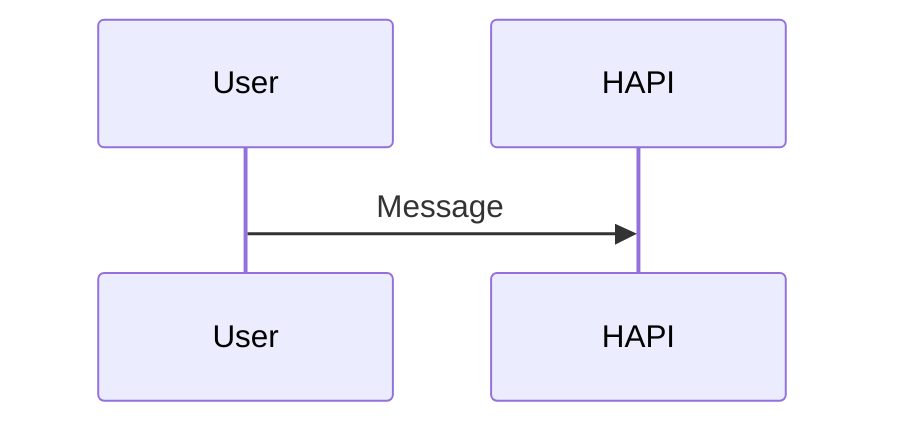

# Mermaid Preview trong HAPI Chat

**Ngày:** 2026-07-16  
**Trạng thái:** Thiết kế đã được user duyệt

## 1. Mục tiêu

Khi câu trả lời của agent chứa code fence `mermaid`, HAPI mặc định hiển thị sơ đồ thay vì mã nguồn. Người dùng vẫn có thể xem/copy mã, phóng to, thu nhỏ, kéo sơ đồ, vừa khung và mở fullscreen thật của trình duyệt.

Thành công khi:

- Code fence `mermaid` hợp lệ hiển thị thành SVG trong chat.
- Code block ngôn ngữ khác giữ nguyên hành vi hiện tại.
- Sơ đồ lớn đọc được bằng zoom và pan trên chuột, trackpad và cảm ứng.
- Mermaid lỗi không làm hỏng toàn bộ tin nhắn; HAPI chuyển riêng block lỗi về mã nguồn.
- Không cần thay đổi database, API, hub, CLI hay định dạng lịch sử tin nhắn.

## 2. Định dạng và luồng hiện tại

Tin nhắn Codex được lưu trong JSON envelope:

```text
role=agent
→ content.type=codex
→ content.data.type=message
→ content.data.message=<Markdown string>
```

Mermaid nằm trong Markdown chuẩn:

````markdown

````

Web hiện đã nhận diện `mermaid` là tên ngôn ngữ và đưa nó qua code-block renderer. Vì Shiki không nạp grammar Mermaid, nội dung đang hạ xuống plain text. Đây là điểm mở rộng cần dùng; không cần tạo format tin nhắn mới.

## 3. Quyết định đã chốt

- Mặc định: **Preview sơ đồ**.
- Bố cục: **thanh công cụ nằm trong header của block**.
- Fullscreen: **Fullscreen API thật của trình duyệt**, không dùng modal giả fullscreen.
- Trong chat:
  - Kéo canvas để pan.
  - `Ctrl/Cmd + cuộn` để zoom; cuộn thường tiếp tục cuộn cuộc trò chuyện.
- Trong fullscreen:
  - Cuộn hoặc pinch để zoom.
  - Kéo để pan.
  - `Esc` thoát bằng hành vi chuẩn của trình duyệt.
- Nút **Vừa khung** đặt lại đồng thời zoom và vị trí.
- Fullscreen không hỗ trợ/bị từ chối: giữ nguyên preview và báo lỗi ngắn; không âm thầm đổi sang modal.

## 4. Phương án kỹ thuật

### Phương án chọn: renderer theo ngôn ngữ

`@assistant-ui/react-markdown` hiện hỗ trợ `componentsByLanguage`. Đăng ký riêng:

```text
mermaid
→ CodeHeader: không render header mặc định
→ SyntaxHighlighter: MermaidBlock tự sở hữu toolbar + preview/source
```

`MermaidBlock` nhận trực tiếp `code` từ Markdown renderer. Nó không quét DOM và không sửa cây Markdown.

### Phương án không chọn

1. **Remark/rehype plugin:** biến code fence thành node tùy chỉnh. Làm được nhưng thêm một tầng biến đổi và contract AST không cần thiết.
2. **Hậu xử lý DOM:** render code trước rồi quét `.language-mermaid`. Khó đồng bộ với React, streaming và cleanup; không dùng.

## 5. Kiến trúc thành phần

```text
MarkdownText
→ componentsByLanguage.mermaid
→ MermaidBlock
   ├─ MermaidToolbar: preview/source, copy, zoom, fit, fullscreen
   ├─ MermaidCanvas: chứa SVG và vùng pan/zoom
   └─ mermaidRenderer: lazy-load, cấu hình, render SVG, báo lỗi
```

Ranh giới trách nhiệm:

- `MarkdownText`: chỉ route code fence `mermaid` sang renderer riêng.
- `MermaidBlock`: quản lý trạng thái hiển thị, fullscreen, thông báo lỗi và kết nối toolbar với canvas.
- `MermaidCanvas`: quản lý transform pan/zoom và đo kích thước để fit.
- `mermaidRenderer`: singleton promise để tải Mermaid một lần; tạo ID duy nhất; cấu hình bảo mật/theme; trả SVG hoặc lỗi đã chuẩn hóa.
- Pan/zoom dùng `@panzoom/panzoom`: TypeScript, hỗ trợ pointer/touch/pinch và không buộc component vào một React wrapper riêng.

## 6. Luồng render

```text
Agent message
→ normalize thành text part
→ MarkdownTextPrimitive
→ gặp code fence mang nhãn mermaid
→ MermaidBlock(code)
→ lazy import mermaid
→ initialize(startOnLoad=false, securityLevel=strict, theme hiện tại)
→ mermaid.render(uniqueId, code)
→ SVG
→ MermaidCanvas
```

Quy tắc vòng đời:

- Chỉ tải Mermaid khi trang thực sự có block Mermaid.
- Mỗi block có ID render duy nhất để nhiều sơ đồ cùng tồn tại.
- Khi code hoặc theme HAPI đổi, block render lại.
- Trong lúc agent đang streaming: debounce render; giữ SVG hợp lệ gần nhất thay vì nhấp nháy lỗi theo từng token.
- Khi message đã ổn định mà render vẫn lỗi: chuyển block sang source view kèm thông báo ngắn.
- Khi unmount: hủy timer, bỏ listener và destroy pan/zoom instance.

## 7. UI/UX chi tiết

### Header

Thứ tự trái sang phải:

```text
Mermaid + nhãn Preview
→ Xem mã
→ Thu nhỏ
→ tỷ lệ zoom
→ Phóng to
→ Vừa khung
→ Fullscreen
```

- Desktop có thể hiện text ở nút `Xem mã`/`Vừa khung`; nút còn lại dùng icon và tooltip.
- Mobile ưu tiên icon; vùng chạm tối thiểu 44×44 px.
- Source view thay nút `Xem mã` bằng `Xem sơ đồ`, giữ nút copy source; ẩn nhóm zoom/fit vì không áp dụng cho mã.
- Tất cả nút có `aria-label`, trạng thái focus rõ và nội dung dịch theo locale HAPI.

### Pan và zoom

- Zoom giới hạn 10%–500%.
- `+`/`−` thay đổi theo hệ số cố định, không cộng trừ tùy tiện; tỷ lệ hiển thị được làm tròn.
- Zoom dùng vị trí con trỏ/tâm pinch làm điểm neo.
- Canvas dùng `grab`; khi kéo dùng `grabbing`.
- Pan không bắt đầu từ toolbar.
- Trong chat, wheel không có `Ctrl/Cmd` không bị `preventDefault`.
- Fullscreen cho phép wheel zoom không cần phím bổ trợ.
- `Vừa khung` đo cả SVG và viewport, đặt SVG ở giữa với khoảng đệm an toàn.
- Lần render đầu và sau khi vào fullscreen sẽ tự vừa khung. Sau khi user đã thao tác, resize thông thường không tự reset vị trí ngoài ý muốn.

### Fullscreen

- Gọi `requestFullscreen()` trên toàn bộ `MermaidBlock`, để header và canvas cùng đi vào fullscreen.
- Theo dõi `fullscreenchange` thay vì giả định promise thành công.
- Khi đã fullscreen, icon đổi thành thoát fullscreen; `Esc` do trình duyệt xử lý.
- Khi API không tồn tại, nút disabled với tooltip giải thích.
- Khi promise bị reject, hiển thị thông báo cục bộ trong block; không làm gián đoạn chat.

### Trạng thái

1. **Đang tải:** canvas skeleton nhẹ; source vẫn truy cập được.
2. **Preview:** SVG + toolbar đầy đủ.
3. **Source:** code gốc + copy + quay lại preview.
4. **Lỗi cú pháp/render:** source view tự động + lỗi ngắn, không đưa stack trace ra UI.
5. **Fullscreen lỗi:** preview giữ nguyên + thông báo cục bộ có thể đóng.

## 8. Bảo mật

Nội dung Mermaid từ agent được xem là dữ liệu không tin cậy.

- Cố định `securityLevel: 'strict'`.
- Không bật `loose`, không bind click handler từ diagram và không cho diagram chạy script.
- Không dùng CDN; Mermaid được đóng gói trong web app.
- Chỉ chèn SVG do Mermaid renderer trả về sau khi đã cấu hình strict.
- Giới hạn kích thước code hợp lý để một block bất thường không khóa UI; block vượt giới hạn chuyển về source với thông báo.

Mermaid mô tả `strict` là chế độ mặc định, encode HTML label và tắt click functionality: <https://mermaid.js.org/config/usage.html#securitylevel>.

## 9. Hiệu năng

- Dynamic import tách Mermaid thành chunk riêng.
- Cache promise module, không tải lại cho từng block.
- Debounce khi streaming; bỏ kết quả render cũ nếu code đã thay đổi.
- Không lưu zoom/pan vào global state hoặc database.
- Không rerender React cho từng pixel pan; thư viện pan/zoom cập nhật transform trực tiếp.
- Chỉ render các block đang được React mount; không thay đổi cơ chế phân trang message hiện tại.

## 10. Phạm vi code dự kiến

| File/khối | Vai trò | Thay đổi dự kiến | Rủi ro |
|---|---|---|---|
| `web/package.json`, lockfile | Dependency web | Thêm `mermaid`, `@panzoom/panzoom` | Bundle tăng; giảm bằng dynamic import |
| `web/src/components/assistant-ui/markdown-text.tsx` | Markdown chat | Route riêng `mermaid` | Phải bảo đảm code block khác không đổi |
| `web/src/components/assistant-ui/mermaid/` | Preview mới | Renderer, block, canvas, toolbar | Luồng chính của tính năng |
| `web/src/lib/locales/{en,vi-VN,zh-CN}.ts` | Chuỗi UI | Thêm nhãn/tooltip/lỗi | Thiếu key giữa locale |
| Test mới cạnh component/lib | Kiểm chứng | Render, lỗi, toolbar, fullscreen, zoom/pan | jsdom không kiểm tra được layout thật |

Dự kiến không thay đổi:

- Hub, CLI, shared protocol, database và API.
- Nội dung message đã lưu.
- Code block không mang nhãn `mermaid`.
- Markdown preview của file trong Editor; phạm vi đầu tiên chỉ là assistant message trong chat.

## 11. Kiểm thử tối thiểu

### Tự động

1. Mermaid hợp lệ → gọi renderer và hiện preview; code block khác vẫn dùng Shiki.
2. Mermaid không hợp lệ → riêng block đó về source view, message còn lại vẫn hiển thị.
3. Streaming/code đổi → kết quả render cũ không ghi đè kết quả mới.
4. Toggle preview/source và copy giữ nguyên chính xác code gốc.
5. Inline wheel chỉ zoom khi có `Ctrl/Cmd`; fullscreen wheel zoom trực tiếp.
6. Pan bằng pointer, zoom/pinch, giới hạn scale và fit/reset hoạt động qua adapter pan/zoom.
7. Fullscreen success, `fullscreenchange`, unsupported và promise rejection đều có trạng thái đúng.
8. Light/dark theme đổi → SVG render lại theo theme mới.
9. Typecheck và web build thành công.

### Kiểm tra trình duyệt thủ công

- Desktop Chromium/Firefox: mouse, trackpad, `Esc`, resize và nhiều diagram trong một message.
- Mobile/PWA: một ngón pan, pinch zoom, vùng chạm, xoay màn hình và fullscreen support thực tế.
- Sơ đồ dài/rộng, chữ tiếng Việt, `<br/>`, sequence diagram và flowchart.

## 12. Rủi ro và khôi phục

- **Fullscreen không đồng đều:** API chưa có hỗ trợ đồng nhất; nút disabled hoặc lỗi cục bộ, preview thường vẫn dùng được.
- **Bundle Mermaid lớn:** bắt buộc dynamic import và kiểm tra output chunk khi build.
- **Streaming gây render dồn:** debounce, generation token và cleanup.
- **SVG/theme khó đọc:** kiểm tra cả light/dark với nội dung thật.
- **Gesture giữ mất cuộn chat:** inline wheel có modifier; kiểm tra mobile thủ công.

Rollback chỉ cần gỡ đăng ký `componentsByLanguage.mermaid` và dependency mới. Dữ liệu không cần migration hay phục hồi vì format message không đổi.

## 13. Tài liệu tham khảo

- Mermaid render API, strict security và cấu hình: <https://mermaid.js.org/config/usage.html>
- Fullscreen API: <https://developer.mozilla.org/en-US/docs/Web/API/Element/requestFullscreen>
- Panzoom: <https://github.com/timmywil/panzoom>
