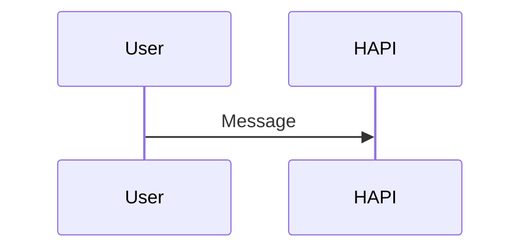

# Mermaid Preview trong HAPI Chat

**Ngày:** 2026-07-16  
**Trạng thái:** UI đã được user duyệt; spec đã qua review rủi ro; chờ user duyệt bản cập nhật

## 1. Mục tiêu

Khi câu trả lời của agent chứa code fence `mermaid`, HAPI mặc định hiển thị sơ đồ thay vì mã nguồn. Người dùng vẫn có thể xem/copy mã, phóng to, thu nhỏ, kéo sơ đồ, vừa khung và mở fullscreen thật của trình duyệt.

Thành công khi:

- Code fence `mermaid` hợp lệ hiển thị thành SVG trong chat.
- Code block ngôn ngữ khác giữ nguyên hành vi hiện tại.
- Sơ đồ lớn đọc được bằng zoom và pan trên chuột, trackpad và cảm ứng.
- Mermaid lỗi không làm hỏng toàn bộ tin nhắn; HAPI chuyển riêng block lỗi về mã nguồn.
- Không cần thay đổi database, API, hub, CLI hay định dạng lịch sử tin nhắn.

### Bề mặt được áp dụng

Renderer này áp dụng cho **final-text part của assistant** ở mọi nơi đang tái sử dụng `SessionChat`:

- Trang session thông thường.
- Dashboard có session được ghim, kể cả panel compact/narrow.
- Team Session Chat modal.
- Chat panel trong Editor desktop/mobile.

Không áp dụng ở vòng đầu cho reasoning, tool result, user message hoặc Markdown file preview trong Editor. Đây là giới hạn phạm vi có chủ ý, không phải khác biệt dữ liệu.

## 2. Định dạng và luồng hiện tại

Tin nhắn Codex được lưu trong JSON envelope:

```text
role=agent
→ content.type=codex
→ content.data.type=message
→ content.data.message=<Markdown string>
```

Mermaid nằm trong Markdown chuẩn:

````markdown

````

Web hiện đã nhận diện `mermaid` là tên ngôn ngữ và đưa nó qua code-block renderer. Vì Shiki không nạp grammar Mermaid, nội dung đang hạ xuống plain text. Đây là điểm mở rộng cần dùng; không cần tạo format tin nhắn mới.

## 3. Quyết định đã chốt

- Mặc định: **Preview sơ đồ**.
- Bố cục: **thanh công cụ nằm trong header của block**.
- Fullscreen: **Fullscreen API thật của trình duyệt**, không dùng modal giả fullscreen.
- Trong chat:
  - Kéo canvas để pan.
  - `Ctrl/Cmd + cuộn` để zoom; cuộn thường tiếp tục cuộn cuộc trò chuyện.
- Trong fullscreen:
  - Cuộn hoặc pinch để zoom.
  - Kéo để pan.
  - `Esc` thoát bằng hành vi chuẩn của trình duyệt.
- Nút **Vừa khung** đặt lại đồng thời zoom và vị trí.
- Fullscreen không hỗ trợ/bị từ chối: giữ nguyên preview và báo lỗi ngắn; không âm thầm đổi sang modal.
- Fullscreen trên PWA/mobile tôn trọng khả năng và orientation hiện tại của nền tảng. Feature này không đổi `manifest.orientation: portrait` của toàn ứng dụng.
- Chỉ code fence dùng nhãn chuẩn lowercase `mermaid` được preview ở vòng đầu; không tự đoán diagram từ code block không nhãn.
- Dùng Mermaid package đầy đủ và hỗ trợ các diagram type built-in hoạt động với cấu hình mặc định. Icon pack, plugin hoặc renderer bên ngoài cần đăng ký riêng nằm ngoài phạm vi.

## 4. Phương án kỹ thuật

### Phương án chọn: renderer theo ngôn ngữ

`@assistant-ui/react-markdown` hiện hỗ trợ `componentsByLanguage`. Đăng ký riêng:

```text
mermaid
→ CodeHeader: không render header mặc định
→ SyntaxHighlighter: MermaidBlock tự sở hữu toolbar + preview/source
```

`MermaidBlock` nhận trực tiếp `code` từ Markdown renderer. Nó không quét DOM và không sửa cây Markdown.

### Phương án không chọn

1. **Remark/rehype plugin:** biến code fence thành node tùy chỉnh. Làm được nhưng thêm một tầng biến đổi và contract AST không cần thiết.
2. **Hậu xử lý DOM:** render code trước rồi quét `.language-mermaid`. Khó đồng bộ với React, streaming và cleanup; không dùng.

## 5. Kiến trúc thành phần

```text
MarkdownText
→ componentsByLanguage.mermaid
→ MermaidErrorBoundary
→ MermaidBlock
   ├─ MermaidToolbar: preview/source, copy, zoom, fit, fullscreen
   ├─ MermaidCanvas: chứa SVG và vùng pan/zoom
   └─ mermaidRenderer: lazy-load, cấu hình, render SVG, báo lỗi
```

Ranh giới trách nhiệm:

- `MarkdownText`: chỉ route code fence `mermaid` sang renderer riêng.
- `MermaidErrorBoundary`: chặn lỗi render React ngoài dự kiến, trả riêng block về source thay vì làm mất toàn message.
- `MermaidBlock`: quản lý trạng thái hiển thị, fullscreen, thông báo lỗi và kết nối toolbar với canvas.
- `MermaidCanvas`: quản lý transform pan/zoom và đo kích thước để fit.
- `mermaidRenderer`: singleton promise để tải Mermaid một lần; tạo ID duy nhất; tuần tự hóa `initialize`/`render` trên Mermaid singleton; cấu hình bảo mật/theme; trả SVG hoặc lỗi đã chuẩn hóa.
- Pan/zoom dùng `@panzoom/panzoom`: TypeScript, hỗ trợ pointer/touch/pinch và không buộc component vào một React wrapper riêng. Panzoom áp dụng lên một HTML wrapper chứa SVG, không transform trực tiếp node SVG gốc.

## 6. Luồng render

```text
Agent message
→ normalize thành text part
→ MarkdownTextPrimitive
→ gặp code fence mang nhãn mermaid
→ MermaidBlock(code)
→ lazy import mermaid
→ initialize(startOnLoad=false, securityLevel=strict, theme hiện tại)
→ mermaid.render(uniqueId, code)
→ SVG
→ MermaidCanvas
```

Quy tắc vòng đời:

- Chỉ tải Mermaid khi trang thực sự có block Mermaid.
- Mỗi block có ID render duy nhất để nhiều sơ đồ cùng tồn tại.
- Mermaid dùng cấu hình global; mọi lần đổi cấu hình theme và gọi render đi qua một queue chung để hai block không giẫm cấu hình của nhau.
- Mỗi block giữ generation token. Kết quả cũ vẫn có thể hoàn tất nhưng không được ghi đè code/theme mới.
- Khi code hoặc theme HAPI đổi, block render lại. Theme lấy từ `useTheme()` hiện có; theme change chấp nhận reset về vừa khung.
- `MermaidBlock` đọc trạng thái message từ assistant-ui. Trong lúc agent đang streaming: debounce 250 ms, gộp các lần cập nhật và giữ SVG hợp lệ gần nhất thay vì nhấp nháy lỗi theo từng token. Khi message kết thúc, render ngay phiên bản cuối.
- Khi message đã ổn định mà render vẫn lỗi: chuyển block sang source view kèm thông báo ngắn. Không tự retry vòng lặp; chỉ retry khi code/theme đổi hoặc user bấm thử lại.
- Trước lần đo/fit đầu tiên, chờ `document.fonts.ready` nếu API tồn tại để giảm lỗi label vượt khung; không chặn source view.
- Khi unmount: hủy timer, bỏ listener và destroy pan/zoom instance.

## 7. UI/UX chi tiết

### Header

Thứ tự trái sang phải:

```text
Mermaid + nhãn Preview
→ Xem mã
→ Thu nhỏ
→ tỷ lệ zoom
→ Phóng to
→ Vừa khung
→ Fullscreen
```

- Container từ 520 px hiện text ở nút `Xem mã`/`Vừa khung`; nút còn lại dùng icon và tooltip.
- Mobile ưu tiên icon; vùng chạm tối thiểu 44×44 px.
- Responsive dựa trên **độ rộng container**, không chỉ viewport: dưới 520 px bỏ badge và chuyển label thành icon; dưới 360 px header thành hai hàng. Không ẩn chức năng trong pinned/editor panel.
- Source view thay nút `Xem mã` bằng `Xem sơ đồ`, giữ nút copy source; ẩn nhóm zoom/fit vì không áp dụng cho mã.
- Tất cả nút có `aria-label`, trạng thái focus rõ và nội dung dịch theo locale HAPI.

### Pan và zoom

- Zoom giới hạn 10%–500%.
- `+`/`−` thay đổi theo hệ số ×1,2; tỷ lệ hiển thị được làm tròn.
- Zoom dùng vị trí con trỏ/tâm pinch làm điểm neo.
- Canvas dùng `grab`; khi kéo dùng `grabbing`.
- Pan không bắt đầu từ toolbar.
- Trong chat, wheel không có `Ctrl/Cmd` không bị `preventDefault`.
- Fullscreen cho phép wheel zoom không cần phím bổ trợ.
- `Vừa khung` đo cả SVG và viewport, đặt SVG ở giữa với khoảng đệm 24 px.
- Lần render đầu và sau khi vào fullscreen sẽ tự vừa khung. Sau khi user đã thao tác, resize thông thường không tự reset vị trí ngoài ý muốn.
- Canvas inline dùng chiều cao `clamp(260px, 45vh, 520px)`; container dưới 360 px giới hạn tối đa 320 px. Sơ đồ lớn được fit thay vì làm message cao vô hạn. Fullscreen chiếm toàn bộ vùng khả dụng.
- Canvas nhận focus bằng bàn phím: `+`/`-` zoom, phím mũi tên pan 40 px mỗi lần, `0` vừa khung. Toolbar vẫn là phương án thay thế đầy đủ cho thao tác kéo.
- Không dùng animation transform khi `prefers-reduced-motion` yêu cầu giảm chuyển động.

### Fullscreen

- Gọi `requestFullscreen()` trên toàn bộ `MermaidBlock`, để header và canvas cùng đi vào fullscreen.
- Gọi API trực tiếp từ click/tap để giữ transient user activation; không đặt sau một bước async khác.
- Theo dõi `fullscreenchange` và kiểm tra `document.fullscreenElement === blockRef` thay vì giả định promise thành công.
- Khi đã fullscreen, icon đổi thành thoát fullscreen; `Esc` do trình duyệt xử lý.
- Khi API không tồn tại, nút disabled với tooltip giải thích.
- Khi promise bị reject, hiển thị thông báo cục bộ trong block; không làm gián đoạn chat.
- CSS `:fullscreen` đặt kích thước canvas, màu nền và safe-area inset rõ ràng; không dựa vào style của ancestor vì element đã vào top layer.

### Trạng thái

1. **Đang tải:** canvas skeleton nhẹ; source vẫn truy cập được.
2. **Preview:** SVG + toolbar đầy đủ.
3. **Source:** code gốc + copy + quay lại preview.
4. **Lỗi cú pháp/render:** source view tự động + lỗi ngắn, không đưa stack trace ra UI; có nút thử lại thủ công.
5. **Fullscreen lỗi:** preview giữ nguyên + thông báo cục bộ có thể đóng.
6. **Chunk/import lỗi:** source view vẫn hoạt động; thông báo không chứa code hoặc stack trace.

## 8. Bảo mật

Nội dung Mermaid từ agent được xem là dữ liệu không tin cậy.

- Cố định `securityLevel: 'strict'`.
- Cố định `startOnLoad: false`, `suppressErrorRendering: true`, `maxTextSize: 50_000` và `maxEdges: 500` thay vì dựa ngầm vào default.
- Mở rộng danh sách `secure` để diagram directive không ghi đè các khóa bảo mật, giới hạn, theme, `themeCSS`, `fontFamily` hoặc `htmlLabels` do HAPI đặt.
- Không bật `loose`, không bind click handler từ diagram và không cho diagram chạy script.
- Không dùng CDN; Mermaid được đóng gói trong web app.
- Chỉ chèn SVG do Mermaid renderer trả về sau khi đã cấu hình strict.
- Block vượt giới hạn text/edge chuyển về source với thông báo. Không hiển thị diagram lỗi mà Mermaid có thể tự chèn vào DOM.
- Mọi log kỹ thuật chỉ ghi loại lỗi, không ghi toàn bộ source diagram vì source có thể chứa nội dung nhạy cảm.

Mermaid mô tả `strict` là chế độ mặc định, encode HTML label và tắt click functionality: <https://mermaid.js.org/config/usage.html#securitylevel>. Schema hiện tại đặt default `maxTextSize=50_000`, `maxEdges=500`, hỗ trợ danh sách `secure` và `suppressErrorRendering`: <https://mermaid.js.org/config/schema-docs/config.html>.

## 9. Hiệu năng

- Dynamic import tách Mermaid thành chunk riêng.
- Cache promise module, không tải lại cho từng block.
- Debounce khi streaming; bỏ kết quả render cũ nếu code đã thay đổi.
- Queue render gộp bản pending cũ của cùng block để streaming không tạo backlog dài.
- Không lưu zoom/pan vào global state hoặc database.
- Không rerender React cho từng pixel pan; thư viện pan/zoom cập nhật transform trực tiếp.
- Chỉ render các block đang được React mount; không thay đổi cơ chế phân trang message hiện tại.
- Web build phải xác nhận chunk Mermaid không vượt giới hạn precache 4 MiB hiện có của Vite PWA. Không tự tăng giới hạn chỉ để làm build pass.

## 10. Phạm vi code dự kiến

| File/khối | Vai trò | Thay đổi dự kiến | Rủi ro |
|---|---|---|---|
| `web/package.json`, lockfile | Dependency web | Thêm `mermaid`, `@panzoom/panzoom` | Bundle tăng; giảm bằng dynamic import |
| `web/src/components/assistant-ui/markdown-text.tsx` | Markdown chat | Route riêng `mermaid` | Phải bảo đảm code block khác không đổi |
| `web/src/components/assistant-ui/mermaid/` | Preview mới | Renderer, block, canvas, toolbar | Luồng chính của tính năng |
| `web/src/index.css` hoặc stylesheet cạnh component | Responsive/fullscreen | Container query, `:fullscreen`, safe area, canvas sizing | Có thể ảnh hưởng layout panel hẹp nếu selector không scope |
| `web/src/lib/locales/{en,vi-VN,zh-CN}.ts` | Chuỗi UI | Thêm nhãn/tooltip/lỗi | Thiếu key giữa locale |
| Test mới cạnh component/lib | Kiểm chứng | Render, lỗi, toolbar, fullscreen, zoom/pan | jsdom không kiểm tra được layout thật |
| Web/PWA build output | Deploy/offline | Thêm dynamic chunk vào precache manifest | Giới hạn 4 MiB và cache update |
| Embedded web asset generation | Single executable | Generator phải tự thu thập chunk mới | Không sửa tay manifest generated |

Dự kiến không thay đổi:

- Hub, CLI, shared protocol, database và API.
- Nội dung message đã lưu.
- Code block không mang nhãn `mermaid`.
- Markdown preview của file trong Editor; phạm vi đầu tiên chỉ là assistant message trong chat.
- Cấu hình orientation toàn PWA.

### Phạm vi tác động gián tiếp

- `MarkdownText` được tái sử dụng qua nhiều layout của `SessionChat`, nên thay đổi một điểm nhưng phải kiểm tra normal, pinned compact, Team modal và Editor panel.
- Service worker sẽ precache dynamic chunk mới; rollout/rollback đi qua cơ chế PWA update hiện có.
- Single executable nhúng toàn bộ `web/dist`; asset generator phải nhìn thấy chunk Mermaid sau build dù không có logic hub mới.
- Mermaid chạy render/layout trên main thread. Giới hạn text/edge giảm rủi ro nhưng không tạo được hard timeout cho tác vụ đồng bộ đã bắt đầu.

## 11. Kiểm thử tối thiểu

### Tự động

1. Mermaid hợp lệ → gọi renderer và hiện preview; fixture gồm flowchart, sequence và ít nhất một diagram type lazy/non-core; code block khác vẫn dùng Shiki.
2. Mermaid không hợp lệ, dynamic import fail hoặc React renderer throw → riêng block đó về source view, message còn lại vẫn hiển thị.
3. Streaming/code đổi → debounce/gộp queue hoạt động và kết quả render cũ không ghi đè kết quả mới.
4. Toggle preview/source và copy giữ nguyên chính xác code gốc.
5. Inline wheel chỉ zoom khi có `Ctrl/Cmd`; fullscreen wheel zoom trực tiếp.
6. Pan bằng pointer, keyboard, zoom/pinch, giới hạn scale và fit/reset hoạt động qua adapter pan/zoom.
7. Fullscreen success, exit, foreign fullscreen element, `fullscreenchange`, unsupported và promise rejection đều có trạng thái đúng.
8. Light/dark theme đổi và hai diagram render gần đồng thời → không giẫm cấu hình/kết quả.
9. Diagram directive không hạ security/limit/theme; fixture chứa HTML/script/click không tạo script, event handler hoặc link hoạt động; block quá 50.000 ký tự hoặc quá 500 edge bị từ chối an toàn; Mermaid không tự chèn error SVG.
10. Component mount trong normal chat, pinned compact, Team modal và Editor panel mà không overflow toolbar.
11. Typecheck, web test và web/PWA build thành công; kiểm tra kích thước/caching của chunk Mermaid.

### Kiểm tra trình duyệt thủ công

- Desktop Chromium/Firefox/Safari trong phạm vi môi trường có sẵn: mouse, trackpad, keyboard, `Esc`, resize và nhiều diagram trong một message.
- Mobile browser/PWA: một ngón pan, pinch zoom, vùng chạm, safe area, orientation portrait hiện tại và fullscreen support thực tế.
- Các bề mặt hẹp: dashboard 3–4 panel, Team modal và Editor side chat.
- Sơ đồ dài/rộng, chữ tiếng Việt, `<br/>`, flowchart, sequence, class/state, ER/Gantt và một diagram type lazy/non-core.
- Theme đổi khi đang preview/fullscreen; lỗi render rồi retry; back/forward hoặc unmount trong lúc render.

## 12. Rủi ro và khôi phục

- **Fullscreen không đồng đều:** API chưa có hỗ trợ đồng nhất; nút disabled hoặc lỗi cục bộ, preview thường vẫn dùng được.
- **PWA đang khóa portrait:** fullscreen trên mobile standalone có thể không tận dụng landscape; không đổi orientation toàn app trong feature này.
- **Bundle Mermaid lớn:** bắt buộc dynamic import và kiểm tra output chunk khi build.
- **PWA precache có trần 4 MiB:** build có thể fail nếu một chunk vượt ngưỡng; ưu tiên split/import phù hợp, không tăng trần mù quáng.
- **Streaming gây render dồn:** debounce, generation token và cleanup.
- **Mermaid có cấu hình global:** queue initialize/render theo theme để tránh race giữa nhiều diagram.
- **Main-thread layout:** không thể hard-cancel một render đồng bộ đã bắt đầu; giữ `maxTextSize`/`maxEdges` và ghi nhận đây là residual risk.
- **SVG/theme khó đọc:** kiểm tra cả light/dark với nội dung thật.
- **Gesture giữ mất cuộn chat:** inline wheel có modifier; kiểm tra mobile thủ công, đặc biệt một-ngón pan trong canvas.
- **Panel hẹp:** toolbar có thể tràn trong dashboard/editor; dùng container query/wrap và test từng surface.
- **Font tải muộn:** chờ font trước lần fit đầu, sau đó cho phép user reset bằng `Vừa khung`.

Rollback chỉ cần gỡ đăng ký `componentsByLanguage.mermaid` và dependency mới. Dữ liệu không cần migration hay phục hồi vì format message không đổi.

## 13. Tài liệu tham khảo

- Mermaid render API, strict security và cấu hình: <https://mermaid.js.org/config/usage.html>
- Fullscreen API: <https://developer.mozilla.org/en-US/docs/Web/API/Element/requestFullscreen>
- Panzoom: <https://github.com/timmywil/panzoom>
