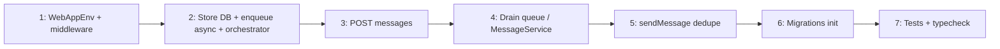

# Ke hoach sua loi Auto-Resume va hang doi tin nhan (chi tiet) — v2

| Thuoc tinh | Gia tri |
|------------|---------|
| **PLAN_NAME (LP)** | `PLAN_AUTO_RESUME_BUGFIX_20260413` |
| **Tier** | M |
| **Version** | 2 (2026-04-13, bo sung sau review-plan) |
| **Nguon** | `.codex/pipeline/.../04-review-implement.output.md`, xac minh follow-up, `03-review-plan-FIX_PLAN.output.md` |
| **Pipeline** | `lp_pipeline.py` khong co trong repo; LittlePea chay tu `~/.claude/skills/...` neu can. |

**Human gate:** Sau khi duyet plan -> `/lp:implement` hoac trien khai thu cong theo phase.

**Change log v2:** Them Execution Boundary; phase **Drain queue** (blocker review); danh so lai phase1-7; AC kem lenh verify; ma tran rui ro; bang HTTP `rejected`; ghi chu caller `engine.sendMessage` tren hub chi co `messages.ts`; quy uoc session id sau merge.

---

## Execution boundary

### Allowed (duoc sua / them)

- `hub/src/web/middleware/auth.ts`, `hub/src/web/server.ts`, `hub/src/web/routes/messages.ts`, `hub/src/web/routes/guards.ts`
- `hub/src/config/features.ts`
- `hub/src/sync/syncEngine.ts`, `hub/src/sync/messageService.ts` (neu can cho delivery)
- `hub/src/queue/messageQueue.ts`, `hub/src/resume/autoResumeOrchestrator.ts`
- `hub/src/store/index.ts` (migration init, accessor DB / API resume_attempts neu can)
- `hub/src/**/*.test.ts` lien quan auto-resume
- `web/src/api/client.ts` — chi khi contract HTTP/JSON doi va can dong bo (uu tien giu shape hien tai)

### Do NOT modify (tru khi bat buoc + ghi ro trong PR)

- `cli/` — khong nam trong pham vi fix nay.
- `shared/` — khong doi schema/protocol breaking; neu bat buoc thi tach task va version.
- `docs/`, `website/` — khong bat buoc cho fix; cap nhat README hub tuy chon sau.

---

## 1. Van de da xac minh (phai sua)

| ID | Mo ta | Muc do |
|----|--------|--------|
| F-1 | `features` khong tren `WebAppEnv`; khong `c.set('features')` -> auto-resume guard khong chay | Critical |
| F-2 | `enqueueMessage` / guard khong `await` -> body 202 sai; TS `EnqueueResult` | Critical |
| F-3 | Inactive + `sendMessage`: queue nhung khong resume that (TODO) | Critical |
| F-4 | `triggerResume` khong qua orchestrator -> C1 khong ap dung | Critical |
| F-5 | Khong map `archived`/`rejected` -> lech 503/4xx | Major |
| F-6 | Hai luong guard vs `sendMessage` | Major |
| F-7 | `runNewMigrations` fire-and-forget | Major |
| F-8 | Typecheck / test hub | Major |
| **F-9 (v2)** | `processQueuedMessages` chi `markAsProcessed`, khong goi `MessageService` -> tin khong vao chat | **Blocker** |

---

## 2. Muc tieu va phi pham vi

**Muc tieu**

- Bat `HAPI_AUTO_RESUME` tren request web; mot luong: inactive + flag -> `await` enqueue -> HTTP dung -> orchestrator -> **gui tin pending ra chat**.
- Typecheck hub sach; C1 qua orchestrator.

**Phi pham vi**

- Monitoring/rollback day du (plan goc Phase 7) — ghi TODO ngan.
- Rollout % / Redis — giu env boolean; cap nhat doc.

---

## 3. Thu tu trien khai

**Nguyen tac:** Khong bien `requireSession` thanh `async` toan codebase; `await` tap trung o handler `POST` va/hoac method engine async.

**Quy uoc session id:** Sau `resumeSession` + `mergeSessions`, moi `waitForSessionActive` / `getSessionFn` / gui tin phai dung **session id hien hanh trong cache** (id da merge). Ghi ro trong PR neu doi bien.

---

## 4. Chi tiet theo phase

### Phase 1 — Feature flag tren web

**File:** `hub/src/web/middleware/auth.ts`, `hub/src/config/features.ts`, `hub/src/web/server.ts`

**Viec lam:** Mo rong `WebAppEnv.Variables` voi `features: FeatureFlags`; middleware `c.set('features', getFeatureFlags())` sau auth (hoac truoc route API theo convention hien tai).

| AC | Verify |
|----|--------|
| `HAPI_AUTO_RESUME=1` -> `c.get('features')?.autoResume === true` | Test unit mock context + kiem tra tay |
| Khong con loi TS `guards.ts` ve `features` | `bun typecheck` (root) |

---

### Phase 2 — Store + SyncEngine: DB cho orchestrator, enqueue async, noi orchestrator

**File:** `hub/src/store/index.ts`, `hub/src/sync/syncEngine.ts`, `hub/src/resume/autoResumeOrchestrator.ts`

**Viec lam (bat buoc dau phase):**

0. **Store:** Them API toi thieu cho orchestrator: vi du `getDatabase(): Database` read-only **hoac** method boc `resume_attempts`. Day la **AC chan** truoc khi khoi tao orchestrator trong engine.

1. `import type { EnqueueResult }`; `async enqueueMessage` + `return await this.messageQueue.enqueue(...)`.
2. Khoi tao `AutoResumeOrchestrator` trong `SyncEngine` voi `db` + adapter `resumeSession` / `getSession` / `archiveSession` dung kieu constructor hien co.
3. `triggerResume` -> delegate orchestrator (khong goi thang `resumeSession` ngoai orchestrator).

| AC | Verify |
|----|--------|
| Store expose du cho orchestrator | Code review |
| Moi call site `enqueueMessage` tu HTTP deu `await` | `rg enqueueMessage hub/src` |
| `resume_attempts` tang/reset qua path production | Test orchestrator/integration |
| Truoc merge nhanh engine: impact analysis | `mcp_gitnexus_impact` target `triggerResume` upstream |

---

### Phase 3 — POST /sessions/:id/messages

**File:** `hub/src/web/routes/messages.ts`, `hub/src/web/routes/guards.ts`

**Viec lam:** Bo enqueue/202 khoi guard sync. Handler: `requireSessionFromParam` khong truyen `autoResume`/`messagePayload`. Neu inactive + `c.get('features')?.autoResume`: `await enqueueMessage` -> `archived` -> 503, `rejected` -> 4xx, `queued` -> `triggerResume` + 202. Nguoc lai: `await sendMessage` nhu cu.

**Bang HTTP `rejected` (mac dinh — co the chinh trong PR):**

| Dieu kien | HTTP |
|-----------|------|
| Payload qua lon (messageQueue) | **400** |
| Trung `localId` trong queue | **409** |
| Loi khac tu enqueue | **400** |

| AC | Verify |
|----|--------|
| Khong serialize `Promise` trong JSON | Inspect response 202 |
| 202/503 khop `web/src/api/client.ts` | Doc client + test tay / integration |

---

### Phase 4 — Drain queue: processQueuedMessages gui tin that

**File:** `hub/src/resume/autoResumeOrchestrator.ts`, co the `hub/src/sync/syncEngine.ts` (inject `MessageService` hoac callback `(sessionId, payload) => Promise<void>` de tranh vong phu thuoc)

**Viec lam:** Thay TODO tai `hub/src/resume/autoResumeOrchestrator.ts` (khoang dong189-200): voi moi pending, parse payload, goi **`MessageService.sendMessage`** (hoac method engine mot lop) voi `sessionId` **canonical** sau resume; thanh cong -> `markAsProcessed`, loi -> `markAsFailed` hoac retry theo policy.

**Edge:** Thu tu gui theo `created_at`; idempotency: neu `localId` da ton tai trong DB message thi skip hoac mark processed (ghi comment).

| AC | Verify |
|----|--------|
| Sau resume + drain, tin user gui luc inactive xuat hien trong lich su session | Test integration / staging |
| Khong mat pending khi loi mot tin | Unit test orchestrator |

---

### Phase 5 — SyncEngine.sendMessage (dedupe)

**File:** `hub/src/sync/syncEngine.ts`

**Pham vi caller hub:** Hien chi `hub/src/web/routes/messages.ts` goi `engine.sendMessage` (khong gom `telegram/bot.ts` — do la API Telegram). Xac nhan lai truoc commit; khong can grep rong toan monorepo cho muc tieu hub.

**Viec lam:** Gom nhanh inactive ve helper noi bo; queue + `triggerResume` khi khong di Phase 3; xoa `console.log` TODO; tranh double enqueue voi Phase 3 (inactive + flag on).

| AC | Verify |
|----|--------|
| Mot request web khong enqueue hai lan cung payload | Test / trace |
| Kenh khac (tuong lai) goi `sendMessage` van an toan | Ghi chu PR |

---

### Phase 6 — Migration khoi dong

**File:** `hub/src/store/index.ts`

**Viec lam:** Dam bao migration chay xong truoc traffic; bo `throw` vo hieu trong `.catch` async — fail fast co kiem soat (log + exit hoac propagate).

| AC | Verify |
|----|--------|
| Khoi dong voi DB cu -> schema + `schema_migrations` dung | `bun run test` migration / tay |

---

### Phase 7 — Test va typecheck

**Viec lam:** Sua narrowing `autoResumeOrchestrator*.test.ts`, `guards.test.ts`, vitest types.

| AC | Verify |
|----|--------|
| Hub typecheck sach | `bun typecheck` |
| Test hub xanh | `bun run test` (scope hub) |

---

## 5. Ma tran rui ro

| ID | Rui ro | L | I | Mitigation |
|----|--------|---|---|------------|
| R1 | Doi `triggerResume` anh huong nhieu route | M | H | gitnexus impact; test integration |
| R2 | Vong phu thuoc Engine / Orchestrator / MessageService | M | M | Inject callback / interface hep |
| R3 | Sai `sessionId` sau merge | M | H | Quy uoc muc 3 + test resume |
| R4 | Double delivery `localId` | L | M | Idempotency Phase 4 |
| R5 | Contract web doi | L | M | Giu shape 202/503; dong bo `client.ts` neu doi |

(L = Likelihood, I = Impact: L/M/H)

---

## 6. Sau merge (ops)

- Staging: `HAPI_AUTO_RESUME=1`; inactive -> POST message -> 202 -> resume -> **tin hien thi trong chat**.
- `npx gitnexus analyze` sau merge (CLAUDE.md).

---

## 7. Human gate

- [ ] Doc plan v2
- [ ] Dong y bang HTTP `rejected` (400/409) hoac ghi sua trong PR
- [ ] Dong y semantics tin queue: cung luong `MessageService` / SSE nhu tin truc tiep (mac dinh **co**)
- [ ] Chay `/lp:implement` hoac assign dev

**Duong dan:** `plans/20260411-0940-auto-resume-inactive-sessions/FIX_IMPLEMENTATION_PLAN_20260413.md`

**Lich su review:** `plans/20260411-0940-auto-resume-inactive-sessions/03-review-plan-FIX_PLAN.output.md` (ket luan ban dau + muc **Cap nhat sau review** khi plan v2 da dong bo).
